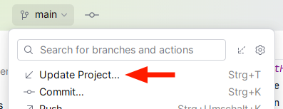

# Erste Übungsaufgaben von GitHub
In Modul 1 bekommen Sie einige Übungsaufgaben aus dem Unterricht via Git
(über GitHub). **Git** ist ein weit verbreitetes Tool für collaborative Arbeit
in Softwareporjekten und kann recht komplex in der Benutzung sein.

Im ersten Modul werden wir Git daher erstmal _nicht_ vertiefen. 
Für Sie ist vorerst nur der **Update Project** Button in der oberen Leiste wichtig.
Über dieses Feature erhalten Sie Lösungen und neue Aufgaben vom Dozenten.



Damit Sie dieses Feature nutzen können, müssen Sie **dieses** Verzeichnis 
als Projektordner in IntelliJ öffnen, dann stehen Ihnen auch alle Git-Features
in der GUI zur Verfügung. Öffnen Sie **nicht** die Unterordner mit den Aufgaben
als Projekt!

Im Verlauf des Unterrichts werden Sie die Aufgaben in den Unterordnern bearbeiten.
Z. B.:
```
_01_HelloWorld/
├── HelloWorld.java
└── README.md
```

In den `README.md`-Dateien finden Sie die Aufgabenstellung für die Übung und/oder
zusätzliche Hinweise und Tipps.

> README-Dateien sind einfach nur [Markdown Text](https://www.jetbrains.com/help/idea/markdown.html).
> GitHub rendert Dateien mit dem Namen `README.md` immer als 
> "Deckblatt" für das Repository und auch für jeden Unterordner.
> Siehe [GitHub flavored Markdown.](https://docs.github.com/get-started/writing-on-github/getting-started-with-writing-and-formatting-on-github/basic-writing-and-formatting-syntax)

Um sog. _Mergekonflikte_ zu vermeiden, **arbeiten Sie bitte nicht in den
Lösungsordnern** (z. B. `_01_BasicDataTypes_Solution/`)!

